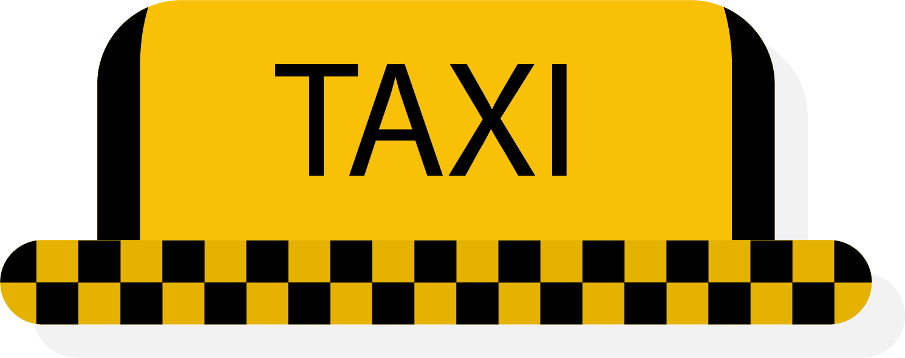
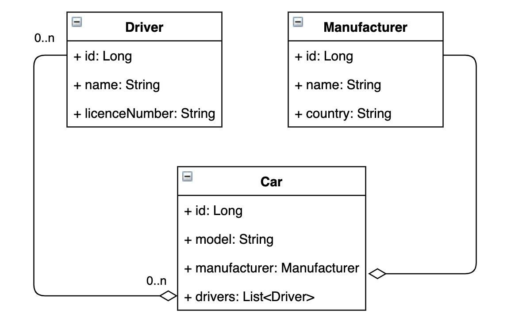
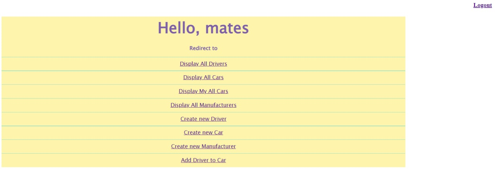
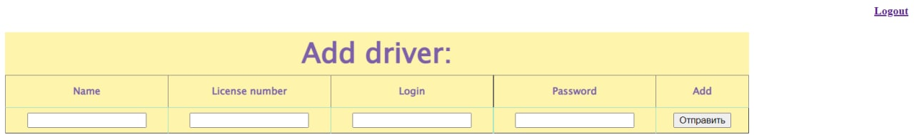
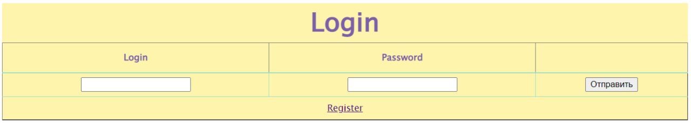

# Taxi Service
<h1 align="center">
  
</h1>

  
 <h4> Table Content </h4>  

    

        • <a href="#-description-" style="color: #a8b6c5">Description</a>
        • <a href="#-features-of-the-program-" style="color: #a8b6c5">Features of the program</a> 
        • <a href="#-project-structure-" style="color: #a8b6c5">Project Structure</a>
        • <a href="#-technologies-" style="color: #a8b6c5">Technologies</a>
        • <a href="#-screenshots-" style="color: #a8b6c5">Screenshots</a> 
        • <a href="#-how-to-run-application-" style="color: #a8b6c5">How to run the application</a>
    

## 📒 Description 📒
This is a simple web application, 
which is written on the principles of SOLID, 
for the taxi service. 
The application has H-tier architecture and is divided into 3 logical parts 
(Presentation layer, Business logic layer, Data logic layer).
Also, it has Authentication filter, if somebody didn't log in he can't get access to application features.

## ⚡️Features of the program  ⚡️

| Feature                 | Query                  |
|-------------------------|------------------------|
| Home page               | `/index` or `/`        |
| Login                   | `/login`               |
| Logout                  | `/logout`              |
| Get all drivers         | `/drivers`             |
| Get driver current cars | `/drivers/cars`        |
| Add driver              | `/drivers/add`         |
| Delete driver           | `/drivers/delete`      |
| Get all cars            | `/cars`                |
| Add car                 | `/cars/add`            |
| Add cars driver         | `/cars/drivers/add`    |
| Delete car              | `/cars/delete`         |
| Get all manufacturers   | `/manufacturers`       |
| Add manufacturer        | `/manufacturers/add`   |
| Delete manufacturer     | `/manufacturer/delete` |

## 🧱 Project structure 🧱
### N-tier architecture
Project structure consists of 3 layers + db:

1. Presentation layer: HTTP requests handling ➡️ packages taxi.controller, taxi.filter; jsp page resources;
2. Business logic layer: We call dao level methods and have model classes ➡️ packages taxi.service, taxi.model;
3. Data logic layer: we manipulating database ➡️ package taxi.dao .

### DB structure 
  

## 🤖 Technologies 🤖

| Technology | Version |
|:-----------|:--------|
| JDK        | 17      |
| Maven      | 4.0.0   |
| TomCat     | 9.0.50  |
| MySQL      | 8.0.22  |
| Servlet    | 4.0.1   |
| JSTL       | 1.2     |

## 📸 Screenshots 📸
### Home page
  

### Registration form
  

### Login page
  

## 🏃‍ How to run application 🏃
1. Clone the project to your IJ from GitHub.
2. Create a DB, schemas and tables in your DBMS using query in `init_db.sql`.
3. Configure connection to DB in ConnectionUtil class with your own URL, username, password and JDBC driver.
4. Configure Tomcat (recommended 9.0.50 version).
5. Run program using `Shift + F10`.
6. The window must automatically open in your browser, if not type this URL `http://localhost:8080/`.
7. Enjoy.
